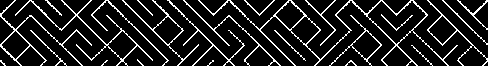

# TenPrint

A python reproduction of the 10 PRINT Commodore64 algorithm with fancy animations :) 
This is the original algorithm: 
#10 PRINT CHR$(205.5+RND(1)); : GOTO 10 
It generates a pattern that resemble a maze, using a single line of code. 
In a rainy boring day I made a simple reproduction of this algorithm using Python and OpenCV. The animations were realized from scratch, and can surely be improved. 
Here you can find a crappy video made recording the screen during the execution of the code: https://www.youtube.com/watch?v=KhtecsSkdKU&ab_channel=FilippoAntonelli

A short list of the realized animations:
- **rotate**: rotates each segment of the maze by the given angle; it includes a step parameter, used for defining how many degrees to rotate in each frame
- **scrollV**: scrolls the maze vertically; the rows_to_scroll parameter defines how many rows need to be scrolled
- **scrollH**: scrolls the maze horizontally; the cols_to_scroll parameter defines how many columns need to be scrolled
- **strobe**: rapidly inverts the colors, producing a strobe effect; the reps parameter defines how many times the colours need to be inverted
- **wave**: a wave that crosses the maze from top to bottom; the step parameter allows to define the wave size and sharpeness
- **vibrate**: all the segments are rotated in both directions, producing a vibration animation; the intensity parameter defines how strong the vibration is

Hope that you like my project :)
Have a cup of coffee and relax in front of your screen!
